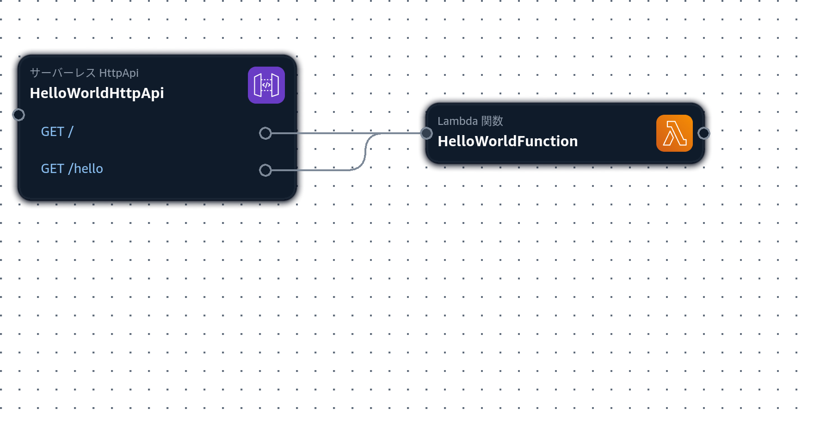
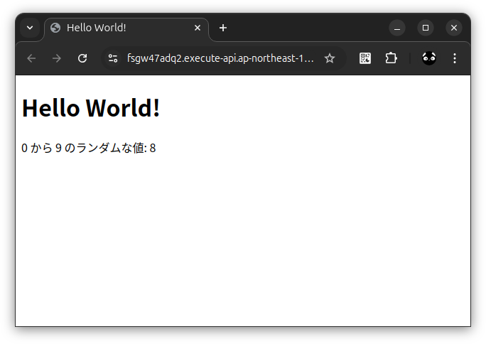
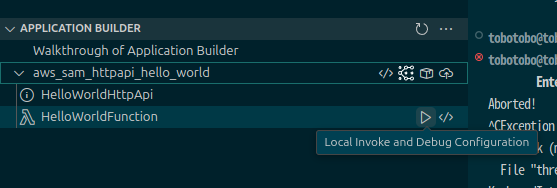
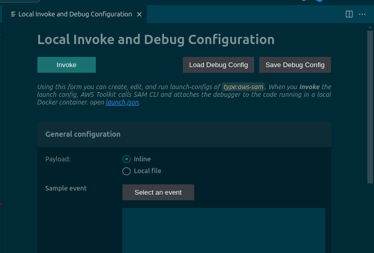
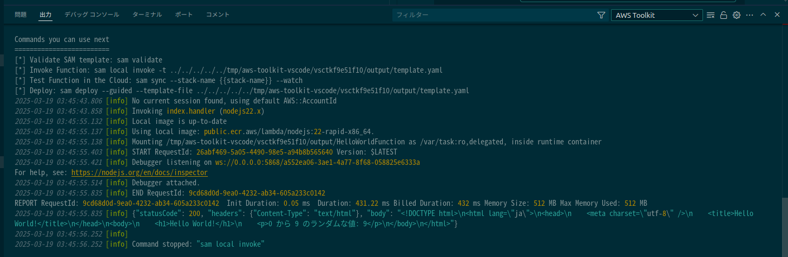

# aws_sam_httpapi_hello_world

## 概要
* AWS SAM を使ってシンプルな API Gateway HTTP API を構築する



## 環境情報
```
$ cat /etc/os-release | grep PRETTY_NAME
PRETTY_NAME="Ubuntu 24.04.2 LTS"

$ aws --version
aws-cli/2.18.6 Python/3.12.6 Linux/6.11.0-19-generic exe/x86_64.ubuntu.24

$ sam --version
SAM CLI, version 1.135.0

$ docker --version
Docker version 28.0.1, build 068a01e
```

## 詳細

### 目次
* [メモ](#メモ)
* [AWS への接続確認](#aws-への接続確認)
* [ビルド](#ビルド)
* [デプロイ](#デプロイ)
* [実行結果に表示された Endpoint URL にアクセス](#実行結果に表示された-endpoint-url-にアクセス)
* [スタックを破棄](#スタックを破棄)
* [Lambda 関数をローカルでテスト実行](#lambda-関数をローカルでテスト実行)
* [ソースの変更と適用の流れ](#ソースの変更と適用の流れ)

### メモ
* template.yaml は手動で作成した。sam init で作成した他のプロジェクト (例: [aws_sam_dotnet_example1](https://github.com/Tobotobo/aws_sam_dotnet_example1)) や色々なネットの template.yaml を参考にした。
* リソースタイプ (例: AWS::Serverless::Function) で検索すれば Amazon AWS Documentation に設定できる項目や説明などリファレンスがあるので参考にする。
* template.yaml を GUI で編集できる Infrastructure Composer は、今回の API Gateway HTTP API のようにリソース一覧には表示されないリソースもあるので注意する。  
  実現したいことは Infrastructure Composer で調べるのではなく AWS SAM で調べる。  
  Infrastructure Composer は template.yaml の可視化ツールと割り切った方が良い。それだけでも十二分に便利。

### AWS への接続確認
```
aws sts get-caller-identity
```

### ビルド
```
sam build --use-container --mount-with WRITE
```

### デプロイ
```
sam deploy \
    --stack-name httpapi-hello-world \
    --region ap-northeast-1 \
    --capabilities CAPABILITY_IAM \
    --no-disable-rollback \
    --resolve-s3
```
※Windows の場合は Git-Bash を用いるか `\` と改行を削除して 1 行にして実行する。

### 実行結果に表示された Endpoint URL にアクセス


### スタックを破棄
```
sam delete --stack-name httpapi-hello-world
```

### Lambda 関数をローカルでテスト実行
* VSCode の拡張機能 AWS Toolkit をインストールする
* サイドバーに AWS が追加され、Lambda 関数をローカルで実行できる  
    実行したい関数の ▶ をクリック
      
    Invoke をクリック  
      
    出力に実行結果が出力される
    

### ソースの変更と適用の流れ
以下を繰り返す。
* ソースを変更する  
  例: src/HelloWorldFunction/index.js の html の編集やランダム値の範囲を 0 〜 99 に変更するなど
* Lambda 関数をローカルでテスト実行 で動作確認
* ビルド
* デプロイ

※本リポジトリでは触れないが、早めにテストコードを追加することを検討した方がよい。